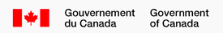

---
output:
  html_notebook:
    toc: yes
    toc_depth: 4
    toc_float: yes
    number_sections: yes
  html_document:
    toc: yes
    toc_depth: 4
    toc_float: yes
  word_document:
    toc: yes
version: '2.0'
date: '2017-09-15'
---

|   |   |
|:------------------------------------|--------------------------------------:|                            


#IMPORTATION DE DONNÉES RCBA

*Version 2.0*

*Environnement et changement climatique Canada*

*Importation réalisée le `r Sys.time()`*

***


```{r, include=FALSE}
## Modules et fonctions personnalisées requises
source("../../../Required_packages.R")
source("../../../Required_functions.R")


## Configuration du projet
source("../../../Configuration/project_settings.R")

```

Ce document est un carnet de note écrit en [Markdown R](http://rmarkdown.rstudio.com). Lorsque vous éxécuter le code intégré au carnet, les résulats apparaitront sous le code correspondant.

Ce rapport présente les résultats de l'importation des fichiers de données du RCBA en format R. Une fois importées dans R, ces données pourront être vérifiées et validées à l'aide des autres carnets R fournis.

##Définition des paramètres de base

###Titre de l'analyse

```{r, include=FALSE}
# Exécuter les lignes suivantes sans modification pour définir un titre à votre analyse, de même que la langue et la plateforme.

analysisTitle <- svDialogs::dlgInput("Saisissez un titre pour votre analyse:", default = "Test", Sys.info()["analysisTitle"])$res
if (is.null(analysisTitle) | length(analysisTitle) == 0) {
  analysisTitle <- "Test"
} else {
  if (analysisTitle == "NA") {
    analysisTitle <- "Test"
  }
}

Language <- "Francais"

# Platform <- "Mac-Linux"
# Platform <- svDialogs::dlgInput("Choisissez la plate-forme que vous utilisez:", default = "Windows", Sys.info()["Platform"])$res
# if(is.null(Platform) | length(Platform) == 0) {Platform = "Windows"} else {if(Platform == "NA") {
Platform <- "Windows" # }}


```

Ce rapport traite de l'importation des données du projet **`r paste(analysisTitle)`**.

###Spécifications du format CSV

Il est important de bien définir comment vos fichiers csv sont construits afin que vos données soient importées correctement. L'acronyme [CSV](http://fr.wikipedia.org/wiki/Comma-separated_values) signifiant *Comma-separated values*, désigne un format informatique ouvert représentant des données tabulaires sous forme de valeurs séparées par des virgules. Ce format n'a jamais vraiment fait l'objet d'une spécification formelle.

Un fichier CSV est un fichier texte, par opposition aux formats dits « binaires ». Chaque ligne du texte correspond à une ligne du tableau et les virgules correspondent aux séparations entre les colonnes. Les portions de texte séparées par une virgule correspondent ainsi aux contenus des cellules du tableau. Une ligne est une suite ordonnée de caractères terminée par un caractère de fin de ligne (line break – CRLF), la dernière ligne pouvant en être exemptée.

Les champs texte peuvent également être délimités par des guillemets. Lorsqu'un champ contient lui-même des guillemets, ils sont doublés afin de ne pas être considérés comme début ou fin du champ. Si un champ contient un signe utilisé comme séparateur de colonne (virgule, point-virgule, tabulation, etc.) ou comme séparateur de ligne (généralement le caractère de retour à la ligne), les guillemets sont obligatoires afin que ce signe ne soit pas confondu avec un séparateur.

Les fichiers CSV sont souvent utilisés autour de logiciels de gestion de bases de donnée ou de tableurs comme *Microsoft Excel*. Un problème potentiel est causé par le fait que les séparateurs ne soient pas standardisés (virgules, points-virgules sous certaines localisations dont la française, etc.). Il faut donc préciser ici comment sont construits vos fichiers CSV. Précisez quel est le caractère utilisé pour séparer les valeurs sur chaque ligne du fichier (SEP) ainsi que le caractère qui définit la marque de décimale (DEC).

- Les valeurs par défaut en anglais sont généralement SEP="," et DEC="."
- Les valeurs par défaut en français sont généralement SEP=";" et DEC=","

**ATTENTION**: il est important de vérifier si vos fichiers de données CSV contiennent des données qui incluent des sauts de ligne. Si c'est le cas, cela pourrait poser des problèmes de lecture de vos données. Corrigez la situation au besoin avant de continuer.

```{r, include=FALSE}
SEP <- ";"
DEC <- ","
```

**Vos fichiers CSV contiennent le caractère « `r paste(SEP)` » comme séparateur et le caractère « `r paste(DEC)` » comme marque de décimale**.

###Format de certaines données

Pour importer les données correctement, le format de certaines données doit être indiqué.

```{r, include=FALSE}
# La base de données RCBA exporte les données en utilisant certains formats.
# C'est le cas pour les données manquantes ainsi que la date.

# Veuillez indiquer la valeur indiquant dans les fichiers une valeur manquante
na.vals <- -99

# Veuillez indiquer le format de la date utilisé dans les fichiers (excluant l'heure).
# 
# Les codes sont:
# %Y: Année avec quatre chiffres (2017)
# %y: Année avec deux chiffres (00-99)
# %m: Mois avec deux chiffres (01-12)
# %B: Mois en caractères (selon la langue de votre système)
# %b: Mois abbrévié en caractères (selon la langue de votre système)
# %d: Jours du mois avec deux chiffres (01-31)
# %A: Nom complet du jour en caractères (selon la langue de votre système)
# %a: Nom abbrévié du jour en caractères (selon la langue de votre système)
dateformat <- "%d/%m/%Y"
```

Le format suivants sont définis pour vos fichiers de données :

  - **Une valeur manquante est indiquée par `r paste(na.vals)`**
  - **La date est inscrite dans le format `r paste(dateformat)`**
  
En utilisant le format de date que vous avez indiqué, le 25 septembre 2017 s'écrit *`r paste(as.Date("25/09/2017", format = dateformat))`*.


###Liste des variables

Une liste complète de toutes les paramètres généraux et physico-chimiques (à l'exception des variables biologiques) est compilée dans le fichier "VariableListe.csv". Ce fichier contient le nom des paramètres en format abbrévié (utilisé dans la base de données du RCBA), le nom complet en français et en anglais, le groupe de paramètres, la forme du paramètre (par exemple, total, dissous, extractible), et l'unité de mesure.

```{r, warning=FALSE, include=FALSE}
# Exécuter les lignes suivantes sans modification
# 
# Pour ajouter des paramètres au fichier VariableList.csv, veuillez communiquer avec Martin Jean (martin.jean@canada.ca)
param.filename <- "VariableList.csv"
param.master <- read.csv(paste("../../../Configuration/", param.filename, sep=""), as.is=TRUE, header=TRUE, sep=",", dec=".")
```

**Le fichier de paramètres *VariableList.csv* a été utilisé**.

###Données censurées

En statistique, les données censurées réfèrent à un type de données (appelées abusivement « données de survie ») caractérisé par une valeur de mesure ou d’observation partiellement connue.

Parmi les types de données censurées, la présence la plus usuelle rencontrée dans les données écologiques est observée lorsqu’une valeur mesurée est en dehors des limites de l’instrument de mesure (limite de détection de la méthode). Par exemple, une balance peut permettre de peser jusqu’à une masse de 3 kg. Si l’on pèse un objet de 3,5 kg, l’observateur ne saura que la masse de l’objet est au moins de 3 kg.

Il existe plusieurs [types de données censurées](https://fr.wikipedia.org/wiki/Censure_(statistiques)) :

- **censurées à gauche** – une valeur est en-dessous d’un valeur, sans savoir précisément de combien (par exemple, la limite de détection d’un appareil).
- **censurées par intervalle** – une valeur est quelque part à l’intérieur d’un intervalle entre deux valeurs.
- **censurées à droite** – une valeur est au-dessus d’une valeur, sans savoir précisément de combien.
- **censurées de Type I** – se produit si une expérience comporte un certain nombre de sujets ou d'objets, mais s’arrête à un moment prédéterminé où des sujets ne sont pas mesurés; les sujets restants sont censurés à droite.
- **censurées de Type II** – se produit si une expérience comporte un certain nombre de matières ou objets et arrête l'essai quand un nombre prédéterminé est observé et ont échoué; les sujets restants sont alors censurés à droite.
- **censurées aléatoires** (ou non-informatifs) – se produit lorsque chaque sujet a un temps censuré qui est statistiquement indépendant du temps d’échec. La valeur observée est le minimum des temps censurés and d’échec; les sujets dont le temps d’échec est plus grand que le temps censuré sont alors censurés à droite.


```{r, include=FALSE}
# Exécutez le code sans modification
NDmethod <- "ReplaceValue"
replace.value <- 0.5
```

Il existe plusieurs méthodes pour traiter les données censurées. **La méthode utilisée ici est le remplacement par la moitié de la limite de détection**.


##Importation des fichiers de données

Cette étape comprend la création et le formattage d'un jeu de données R comprenant quatre matrices principales : données générales, environnementales, biologiques, et spatiales.

###Fichiers importés

```{r, include=FALSE}
# Note: ces fichiers doivent se trouver dans votre dossier de projet
envFilename <- "Habitat.csv"
bioFilename <- "Benthic.csv"
```
**Les fichiers suivants ont été importés dans cette analyse :**

  - Données biologiques : **`r paste(bioFilename)`**
  - Données environnementales : **`r paste(envFilename)`**


###Importation des fichiers CSV


####Fichier de données environnementales

Les données environnementales ont été importées. La liste des suppressions suit (lignes ou colonnes ne possédant pas de données).


> 
> *Vérifier les colonnes et lignes supprimées et assurez-vous que cela réflète bien la réalité.*

```{r, echo=FALSE, warning=FALSE}
# Exécutez le code sans modification
all.dataset.ENV <- read.csv(paste("Data_Donnees/", envFilename, sep=""), as.is=TRUE, header=TRUE,
	 		 	   na.string=na.vals, sep=SEP, dec=DEC, encoding = "latin1")
dataset.ENV <- rm.NAcol(all.dataset.ENV)
dataset.ENV <- rm.NArows(dataset.ENV)
```

***

**Les données environnementales importées comprenaient `r nrow(all.dataset.ENV)` visites (lignes) et `r ncol(all.dataset.ENV)` paramètres (colonnes). Une fois nettoyé, les données environnementales contiennent `r nrow(dataset.ENV)` visites (lignes) et `r ncol(dataset.ENV)` paramètres (colonnes)**. Le tableau suivant montre les données environnementales importées.

> 
> *Vérifiez les données et assurez-vous que cela réflète bien la réalité. Examinez particulièrement les éléments suivants:*
>
> - *Le fichier csv des données environnementales a-t'il été lu correctement?*
> - *Les valeurs manquantes sont-elles encodées correctement (NA)?*
> - *Les données censurées ont-elles été transformées correctement?*
> - *Des colonnes sont-elles manquantes?*


```{r, echo=FALSE, warning=FALSE}
# Supprime les premières colonnes de la table Environnement pour ne conserver
# que les données environnementales
dataset.ENV[1:(match("GPSDatum", names(dataset.ENV)))] <- list(NULL)

datatable(dataset.ENV, extensions = c('FixedColumns', 'Scroller'), options = list(dom = 't', scrollX = TRUE, fixedColumns = TRUE, deferRender = TRUE, scroller = TRUE))
```


####Fichier de données biologiques

Les données biologiques ont été importées. La liste des suppressions suit (lignes ou colonnes ne possédant pas de données).

> 
> *Vérifier les colonnes et lignes supprimées et assurez-vous que cela réflète bien la réalité.*

```{r, echo=FALSE, warning=FALSE}
all.dataset.BIO <- read.csv(paste("../Data_Donnees/", bioFilename, sep = ""), as.is=TRUE, header=TRUE,
	 			   na.string=na.vals, sep=SEP, dec=DEC, row.names=1, encoding = "latin1")
dataset.BIO <- rm.NAcol(all.dataset.BIO)
dataset.BIO <- rm.NArows(dataset.BIO)
```

***

**Les données biologiques importées comprenaient `r nrow(all.dataset.BIO)` visites (lignes) et `r ncol(all.dataset.BIO)` paramètres (colonnes). Une fois nettoyé, les données biologiques contiennent `r nrow(dataset.BIO)` visites (lignes) et `r ncol(dataset.BIO)` paramètres (colonnes)**. Le tableau suivant montre les données biologiques importées.

> 
> *Vérifier les données et assurez-vous que cela réflète bien la réalité. En particulier, répondez aux questions suivantes :*
>
> - *Les taxons sont-ils tous présents?*
> - *Les valeurs nulles sont-elles encodées correctement (0)?*
> - *Le nombre de visites du fichier de données biologiques (`r nrow(dataset.BIO)`) correspond à celui du fichier de données environnementales (`r nrow(dataset.ENV)`)?*


```{r, echo=FALSE, warning=FALSE}
# Supprime les premières colonnes de la table Benthic pour ne conserver
# que les données biologiques
dataset.BIO[1:(match("TotalSample", names(dataset.BIO)))] <- list(NULL)

# Remplace les valeurs NA par 0 dans la table Benthic
dataset.BIO[is.na(dataset.BIO)] <- 0

#Afficher le tableau de données importé
datatable(dataset.BIO, extensions = c('FixedColumns', 'Scroller'), options = list(dom = 't', scrollX = TRUE, fixedColumns = TRUE, deferRender = TRUE, scroller = TRUE))
```


####Ficher de la liste des visites

Une liste de visites (identifiées au moyen des rubriques *Site, SampleDate, SampleNumber*) a été créée à partir des fichiers importés plus haut.

```{r, echo=FALSE}
# En utilisant les fichiers exportées de la base de données
#   RCBA, créer une liste unifiée des noms d'échantillons (Site, date, et numéro d'échantillon)
    names.BIO <- all.dataset.BIO[, c("Site", "SampleDate", "SampleNumber")]
    names.HAB <- all.dataset.ENV[, c("Site", "SampleDate", "SampleNumber")]
    dataset.NAM <- unique(rbind(names.BIO, names.HAB))
    dataset.NAM <- rm.Time(dataset.NAM)
	dataset.NAM2 <- rownames_to_column(dataset.NAM, var = "rownames")
	dataset.NAM2 <- arrange(dataset.NAM2, Site, SampleDate, SampleNumber)
```

> 
> *Vérifier les données et assurez-vous que cela réflète bien la réalité. En particulier, répondez à la question suivante :*
>
> - *Les trois colonnes identifiant les visites (Site, SampleDate et SampleNumber) sont-elles présentes?*
> - *Les dates ont-elles été lues correctement?*
> - *Le nombre de visites de ce fichier (`r nrow(dataset.NAM)`) correspond-il à celui du fichier de données biologiques (`r nrow(dataset.BIO)`) et du fichier de données environnementales (`r nrow(dataset.ENV)`)?*


```{r, echo=FALSE, warning=FALSE}
#Afficher le tableau de données créé
datatable(dataset.NAM)
```

####Fichier de données générales

Un fichier comprenant les données générales a été créée à partir des fichiers importés plus haut.

```{r, echo=FALSE}
# Créer un fichier dataset.GEN pour les données générales
# Les lignes contenant des valeurs manquantes seront supprimées
dataset.GEN <- all.dataset.BIO[, 1:(match("TotalSample", names(all.dataset.BIO)))]
paste("Fichier de données générales créé à partir d'un extrait du fichier", bioFilename)
genFilename <- paste("Extrait de ", bioFilename, sep="")
dataset.GEN <- rm.NAcol(dataset.GEN)

# Supprime l'heure dans la colonne SampleDate
dataset.GEN <- rm.Time(dataset.GEN)
			cat("Heures supprimées du fichier dataset.GEN", "\n")

```


> 
> *Vérifier les données et assurez-vous que cela réflète bien la réalité. En particulier, répondez aux questions suivantes :*
>
> - *L'ensemble des colonnes (de « Taxonomist » à « TotalSample ») est-il présent?*
> - *Le nombre de visites de ce fichier (`r nrow(dataset.GEN)`) correspond-il à celui de la liste des visites (`r nrow(dataset.NAM)`), du fichier de données biologiques (`r nrow(dataset.BIO)`) et du fichier de données environnementales (`r nrow(dataset.ENV)`)?*
> - *Les valeurs de la colonne « Date » ont-elles été importées correctement? Correspondent-elles bien aux dates d'échantillonnage?*


```{r, echo=FALSE, warning=FALSE}
#Afficher le tableau de données créé
datatable(dataset.GEN, extensions = c('FixedColumns', 'Scroller'), options = list(dom = 't', scrollX = TRUE, fixedColumns = TRUE, deferRender = TRUE, scroller = TRUE))
```

####Fichier de coordonnées spatiales

Un fichier comprenant les coordonnées géographiques a été créée à partir des fichiers importés plus haut.

```{r, echo=FALSE}
# Exécuter ces lignes tel quel
# Créer un fichier dataset.SPA pour les coordonnées géographiques
# Les lignes contenant des valeurs manquantes seront supprimées
# Une liste des coordonnées est également créée
dataset.SPAb <- all.dataset.BIO[, c("Longitude", "Latitude", "GPSDatum")]
dataset.SPAe <- all.dataset.ENV[, c("Longitude", "Latitude", "GPSDatum")]
dataset.SPAb <- rownames_to_column(dataset.SPAb, var = "rownames")
dataset.SPAe <- rownames_to_column(dataset.SPAe, var = "rownames")
dataset.SPA <- unique(rbind(dataset.SPAb, dataset.SPAe))
dataset.SPA <- arrange(dataset.SPA, rownames)
rownames(dataset.SPA) <- dataset.SPA[, "rownames"]
dataset.SPA2 <- dataset.SPA
dataset.SPA["rownames"] <- NULL
NA.SPA <- get.NArows(dataset.SPA)
NA.SPA <- rownames_to_column(NA.SPA, var = "rownames")
NA.SPA <- inner_join(NA.SPA, dataset.NAM2, by = "rownames")
rm(dataset.SPAb)
rm(dataset.SPAe)
paste("Fichier de coordonnées géographique créé à partir d'un extrait des fichiers", bioFilename, "et", envFilename)
spaFilename <- paste("Extrait de ", bioFilename, "et", envFilename, sep="")
dataset.SPA <- rm.NArows(dataset.SPA)
```

> 
> *Vérifier les données et assurez-vous que cela réflète bien la réalité. En particulier, répondez aux questions suivantes :*
>
> - *Les valeurs de la colonne « GPSDattum » doivent idéalement être toutes identiques. Est-ce le cas?*
> - *Le nombre de visites de ce fichier (`r nrow(dataset.SPA)`) correspond-il à celui de la liste des visites (`r nrow(dataset.NAM)`), du fichier de données générales (`r nrow(dataset.GEN)`), du fichier de données biologiques (`r nrow(dataset.BIO)`) et du fichier de données environnementales (`r nrow(dataset.ENV)`)?*
> - *Les valeurs des colonnes « Latitude » et « Longitude » doivent être non-nulles. Est-ce bien le cas?*


```{r, echo=FALSE, warning=FALSE}
#Afficher le tableau de données créé
datatable(dataset.SPA)
#rm(all.dataset.BIO)
#rm(all.dataset.ENV)
```

**Note** : Les coordonnées géographiques seront représentées sur une carte au moyen du carnet de vérification des données spatiales.

###Enregistrement des fichiers R

Les cinq fichiers de données (visites, données générales, données environnementales, données biologiques, et coordonnées spatiales) sont sauvegardés en format *RData* dans le sous-dossier *Data_Donnees*.

```{r, include=FALSE}
#Enregistrer le jeu de données créé dans des fichiers .RData pour utilisation ultérieure
save(dataset.ENV, file="../Data_Donnees/dataset.Env.RData")
save(dataset.BIO, dataset.BIO2, file="../Data_Donnees/dataset.Bio.RData")
save(dataset.SPA, file="../Data_Donnees/dataset.Spa.RData")
save(dataset.GEN, file="../Data_Donnees/dataset.Gen.RData")
save(dataset.NAM, file="../Data_Donnees/dataset.Nam.RData")
```

#Prochaines étapes
Vos données sont maintenant prêtes à être vérifiées et validées.

Reportez-vous au document *LISEZMOI.md* pour plus de détails sur la procédure de vérification et de validation de vos donneés.

#Historique des modifications
**Quoi de nouveau, mis à jour ou corrigé dans cette version**

***
 Nouveau &nbsp;&nbsp;&nbsp;    Mise à jour &nbsp;&nbsp;&nbsp;   Corrigé

***

**CABIN_vv_importation.Rmd Version 2.03 - 13 février 2020**

Ajout de l'objet dataset.BIO2 dans dataset_Bio.RData.

   **Enregistrement de l'objet dataset.BIO2** --- Modification de l'enregistrement du fichier dataset_Bio.RData pour qu'il contienne à la fois dataset.BIO et dataset.BIO2.

***

**RCBA_vv_importation.Rmd Version 2.01 — 16 janvier 2018**

Ajout d'un manière plus robuste de créer la liste des coordonnées géographiques par l'utilisation des deux fichiers benthiques et d'habitat.

   **Donneés spatiales** --- Modification du code afin de créer la liste des coordonnées géographiques. Maintenant, les fichiers *Benthic* et *Habitat* sont utilisés afin de générer une liste unifiée.

   **Liste des coordonnées spatiales manquantes** --- Une nouvelle liste des visites sans coordonnées géographiques est créée.

***

**RCBA_vv_importation.Rmd Version 2.0 — 12 septembre 2017**

L'outil d'importation est complètement réécrit sous la forme d'un carnet R (*Notebook R*).

   **Actions** --- Ajout de suggestions d'action pour vérifier l'importation des données dans R.

   **Carnet R (*R Notebook*)** --- L'outil d'importation a été complétement réécrit en utilisant la nouvelle technologie de carnet R.

***

**RCBA_vv_importation.Rmd Version 1.0 — 16 juin 2017**

Version initiale de l'outil d'importation.

   **Première version**.


***

Développé par [Martin Jean](mailto:martin.jean@canada.ca) et Evelyne Paquette-Boisclair